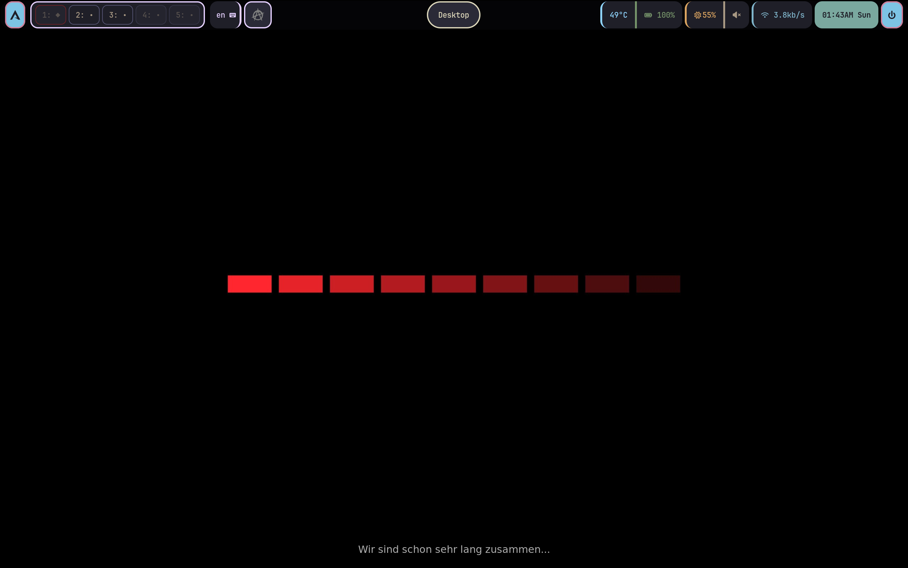
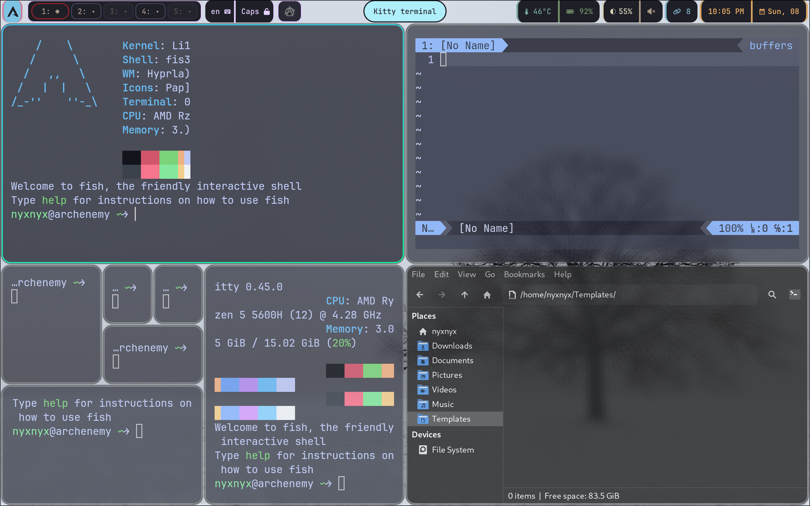
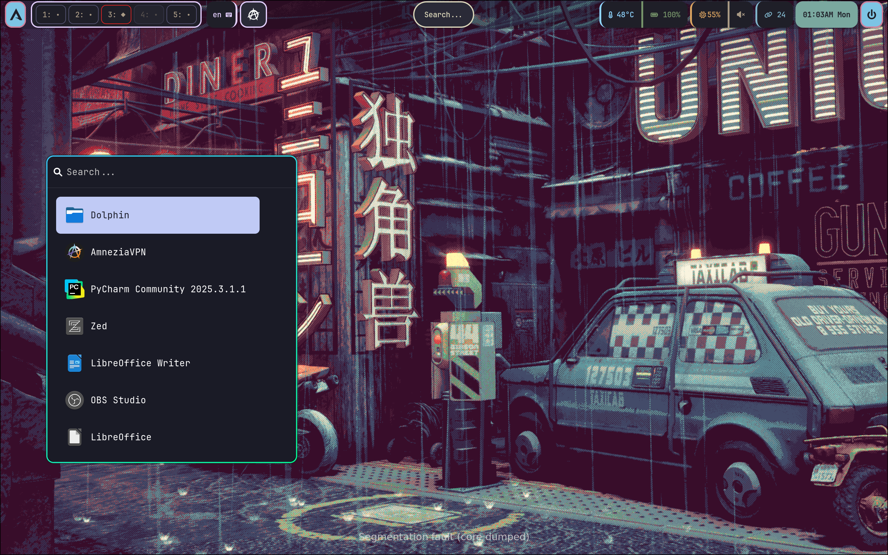
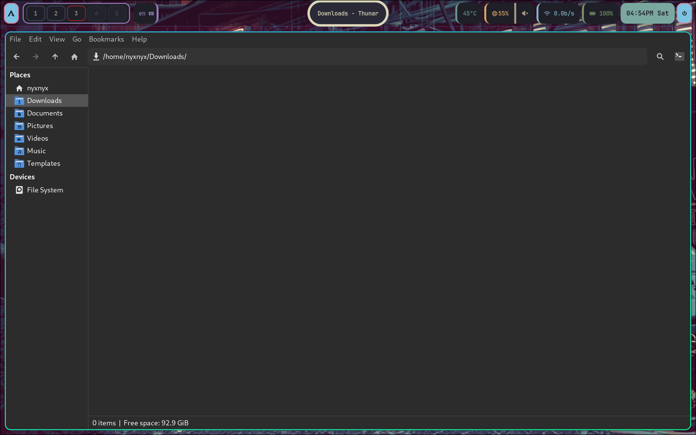
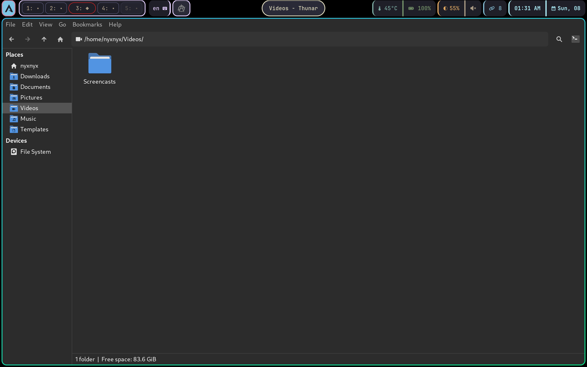
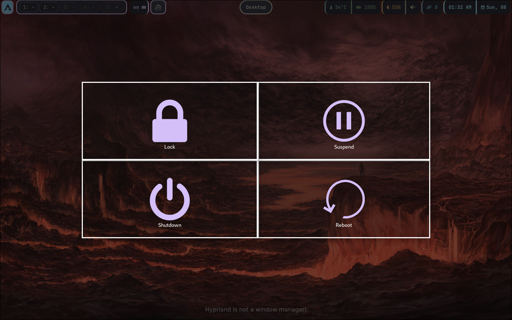

# Arch Configuration Files

### 🛠️ Tech Stack

### 📊 Project Stats

 

<!-- INFORMATION -->
<h1 align="left">About</h1>

 

 - OS: **`Arch Linux`**
 - WM: **`Hyprland`**
 - Bar: **`Waybar`**
 - Terminal: **`Kitty`**
 - App Launcher: **`Wofi`**
 - Shell: **`Fish`**
 - File Manager: **`Thunar/Dolphin`**
 - GUI Text editor: **`Mousepad`**
 - Logout menu: **`Wlogout`**

 

<!-- IMAGES -->
## Gallery

 Click to see more screenshots

### Desktop Appearance

### Multiple Windows

### Application Menu

### Application Launcher

### File Manager

### Wlogout Menu

<!-- Documentation -->
## 📚 Documentation

- [**Configuration Setup**](./docs/CONFIGURATION_SETUP.md) - Transfer dotfiles to new system
- [**Software List**](./docs/INSTALLED_SOFTWARE.md) - Installed packages
- [**Shell Scripts**](./docs/SHELL_SCRIPTS.md) - Custom utility scripts
- [**Hotkeys**](./docs/HOTKEYS.md) - Hotkeys used in current configuration

## License

This project is licensed under the MIT License - see the [LICENSE](LICENSE) file for details.

## See also

### A source of inspiration

This setup was highly inspired by this
[Arch-kit](https://github.com/Zilero232/arch-install-kit/tree/master?tab=readme-ov-file)

### Some Arch installation guides:

* [Ksk Royal archinstall](https://www.youtube.com/watch?v=mWl4P6DOt9M)
* [Ksk Royal install guide](https://www.youtube.com/watch?v=NxqU1G8hKWk)
* [Comfy install guide](https://www.youtube.com/watch?v=68z11VAYMS8)
* [How I install arch](https://www.youtube.com/watch?v=YC7NMbl4goo)

### Some fierce guides for arch:

* [Guide with archinstall](https://www.youtube.com/watch?v=SBM2BUW-OH8)
* [Guide without archinstall](https://www.youtube.com/watch?v=13NB0zP2gXY)

### Review on Hyprland:

* [Hyprland review](https://www.youtube.com/watch?v=DGzHxZCzfio)

### Text review on Hyprland customization options:

* [Hyprland customization options](https://pingvinus.ru/note/hyprland-configuration)
